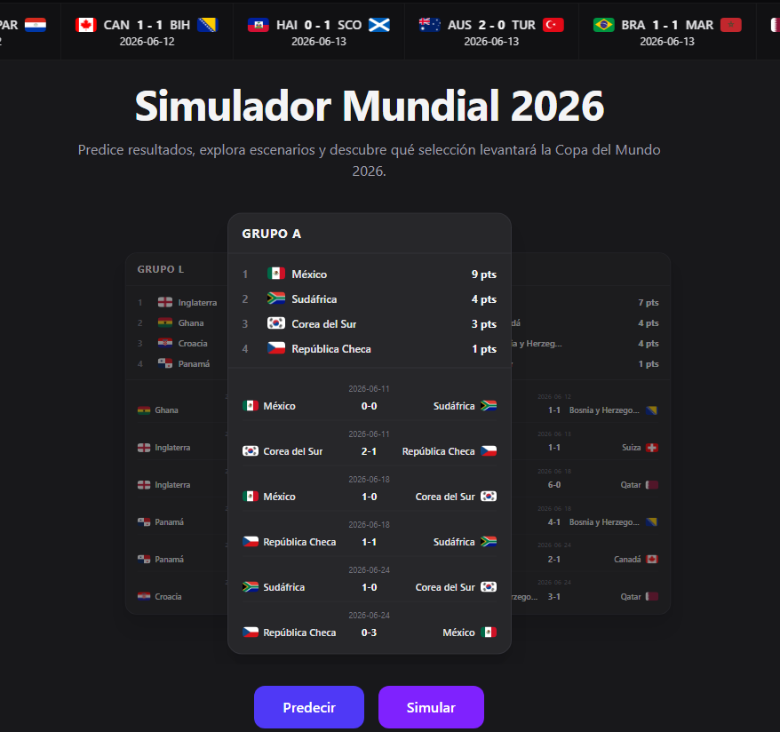
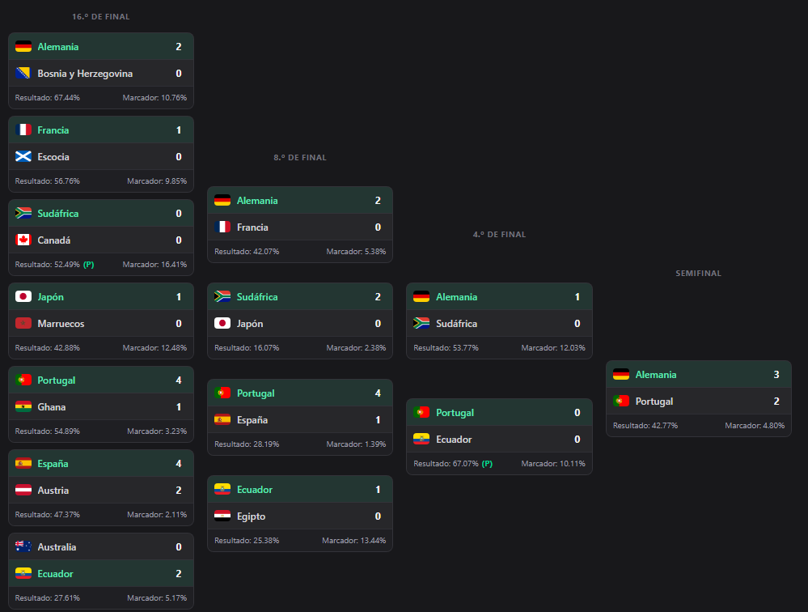

# ⚽ World Cup Simulator 2026

A web-based FIFA World Cup 2026 prediction and simulation platform, combining **match simulation algorithms** with an **interactive user experience**.

---

## 🧠 Overview

This platform enables users to:

- 🏆 View World Cup groups and match fixtures
- 🎯 Manually predict match outcomes and build tournament brackets
- 🎲 Run automatic tournament simulations with simple or adaptive algorithms
- 📊 Navigate the complete knockout stage bracket (Round of 32 to Final)

---

## 🧩 Key Features

- **Manual Prediction Mode**: Enter your own match results and build your perfect bracket
- **Simulation Mode**: Let the algorithm predict outcomes using team ratings
- **Adaptive Simulation**: Ratings evolve as the tournament progresses for more dynamic results
- **Score-Based or Outcome-Based**: Choose between detailed score predictions or simple win/loss/draw
- **Full Tournament Coverage**: From group stage to the final, including third-place qualifiers

---

## 🏗️ Architecture

| Layer | Technology |
|-------|------------|
| **Frontend** | React 19 + TypeScript (Vite + Bun) |
| **Backend** | .NET 9 (Web API) |
| **Database** | PostgreSQL |

---

## 🔗 Repositories

- 🟨 **Frontend**: [https://github.com/World-Cup-Simulator/frontend](https://github.com/World-Cup-Simulator/frontend)
- 🟩 **Backend**: [https://github.com/World-Cup-Simulator/backend](https://github.com/World-Cup-Simulator/backend)

---

## 📸 Visual Overview

### 🏠 Home

Live match ticker and interactive groups carousel with team standings.

[

### 🎯 Prediction Mode

Manual match entry with automatic standings calculation and interactive bracket builder.

[

### 🎲 Simulation Mode

Automatic tournament simulation with full bracket visualization and match-by-match progression.

[

---

## ⚙️ Core Features

- ✅ Browse all 12 World Cup groups (A-L)
- ✅ View all group stage matches
- ✅ Manual prediction with bracket builder
- ✅ Automatic simulation (Simple & Adaptive modes)
- ✅ Score-based and outcome-based predictions
- ✅ Third-place team qualification logic
- ✅ Full knockout bracket (Round of 32 → Final)
- ✅ Team ratings based on historical data
- ✅ Responsive design for all devices

---

## 🎯 Project Goal

To build a World Cup prediction platform that:

- Makes tournament predictions fun and accessible for everyone
- Provides realistic simulations based on team performance data
- Supports both manual and automated prediction workflows
- Follows scalable and maintainable architectural practices

---

## 🌐 Language

> The application UI is currently in Spanish, while the codebase and documentation are written in English.

---

## 👨‍💻 Author

Developed by Alejandro Goró as part of a professional portfolio project.

---

## 🚀 Project Status

🟢 Completed (portfolio project)
